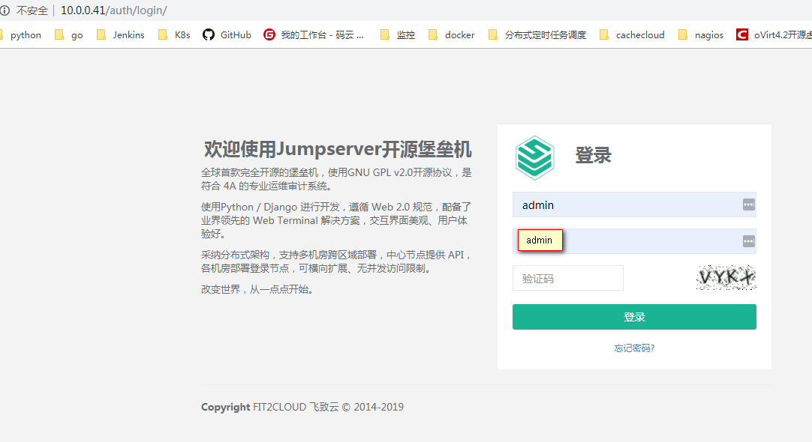
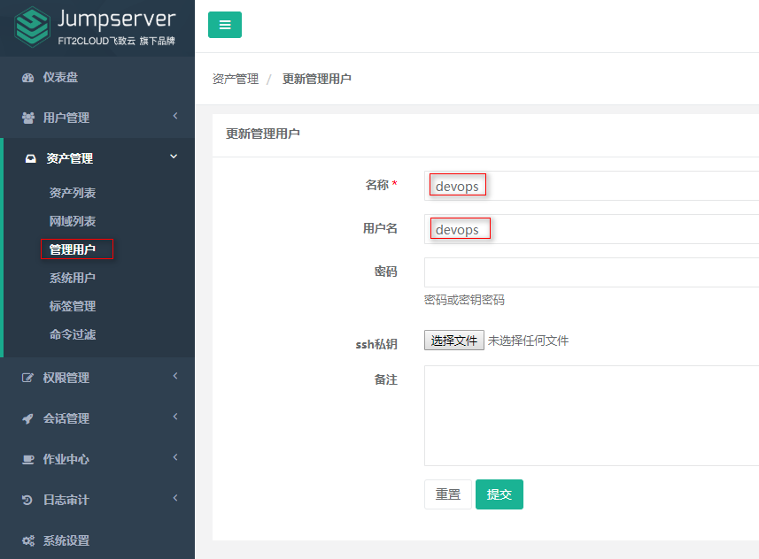
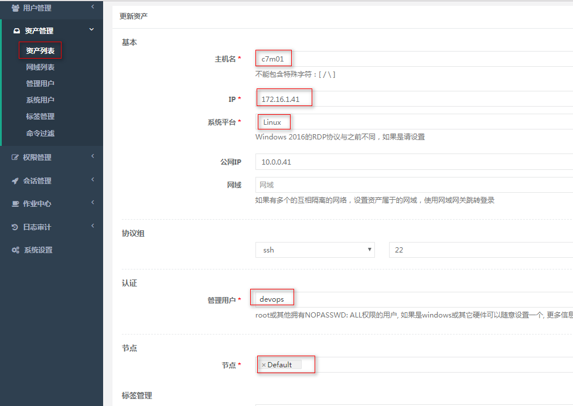
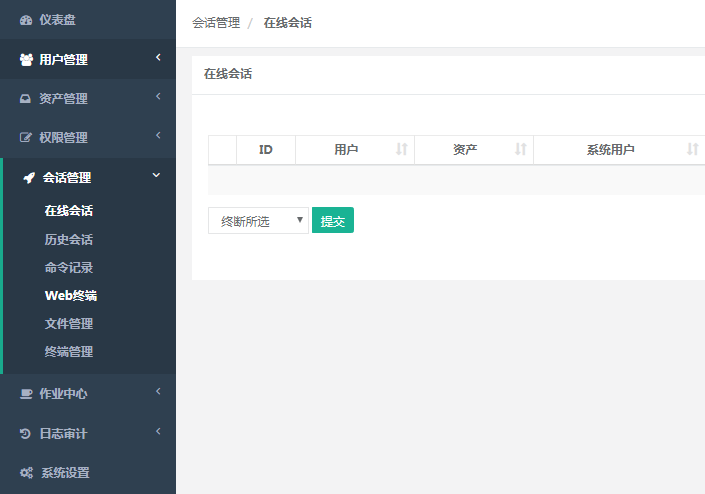
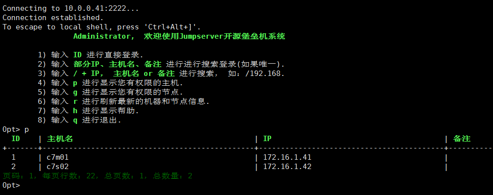

[TOC]


# jumpserver安装使用


# 1.1 jumpserver介绍

Jumpserver 是全球首款完全开源的堡垒机, 使用 GNU GPL v2.0 开源协议, 是符合 4A 的专业运维审计系统。

Jumpserver 使用 Python / Django 进行开发, 遵循 Web 2.0 规范, 配备了业界领先的 Web Terminal 解决方案, 交互界面美观、用户体验好。

Jumpserver 采纳分布式架构, 支持多机房跨区域部署, 中心节点提供 API, 各机房部署登录节点, 可横向扩展、无并发访问限制。

Jumpserver 现已支持管理 SSH、 Telnet、 RDP、 VNC 协议资产。

官方文档：https://docs.jumpserver.org/zh/master/index.html


# 1.2 自建服务器极速安装

生产环境建议使用 1.4.8 版本

说明
全新安装的 Centos7 系统
保持服务器网络畅通

开始安装
以下命令均在一个终端里面执行

```shell
echo -e "\033[31m 1. 防火墙 Selinux 设置 \033[0m" \
  && if [ "$(systemctl status firewalld | grep running)" != "" ]; then firewall-cmd --zone=public --add-port=80/tcp --permanent; firewall-cmd --zone=public --add-port=2222/tcp --permanent; firewall-cmd --permanent --add-rich-rule="rule family="ipv4" source address="172.17.0.0/16" port protocol="tcp" port="8080" accept"; firewall-cmd --reload; fi \
  && if [ "$(getenforce)" != "Disabled" ]; then setsebool -P httpd_can_network_connect 1; fi
```


```shell
 echo -e "\033[31m 2. 部署环境 \033[0m" \
  && yum update -y \
  && ln -sf /usr/share/zoneinfo/Asia/Shanghai /etc/localtime \
  && yum -y install kde-l10n-Chinese \
  && localedef -c -f UTF-8 -i zh_CN zh_CN.UTF-8 \
  && export LC_ALL=zh_CN.UTF-8 \
  && echo 'LANG="zh_CN.UTF-8"' > /etc/locale.conf \
  && yum -y install wget gcc epel-release git \
  && yum install -y yum-utils device-mapper-persistent-data lvm2 \
  && yum-config-manager --add-repo http://mirrors.aliyun.com/docker-ce/linux/centos/docker-ce.repo \
  && yum makecache fast \
  && rpm --import https://mirrors.aliyun.com/docker-ce/linux/centos/gpg \
  && echo -e "[nginx-stable]\nname=nginx stable repo\nbaseurl=http://nginx.org/packages/centos/\$releasever/\$basearch/\ngpgcheck=1\nenabled=1\ngpgkey=https://nginx.org/keys/nginx_signing.key" > /etc/yum.repos.d/nginx.repo \
  && rpm --import https://nginx.org/keys/nginx_signing.key \
  && yum -y install redis mariadb mariadb-devel mariadb-server MariaDB-shared nginx docker-ce \
  && systemctl enable redis mariadb nginx docker \
  && systemctl start redis mariadb \
  && yum -y install python36 python36-devel \
  && python3.6 -m venv /opt/py3
```


```shell
echo -e "\033[31m 3. 下载组件 \033[0m" \
  && cd /opt \
  && if [ ! -d "/opt/jumpserver" ]; then git clone --depth=1 https://github.com/jumpserver/jumpserver.git; fi \
  && if [ ! -f "/opt/luna.tar.gz" ]; then wget https://demo.jumpserver.org/download/luna/1.5.4/luna.tar.gz; tar xf luna.tar.gz; chown -R root:root luna; fi \
  && yum -y install $(cat /opt/jumpserver/requirements/rpm_requirements.txt) \
  && echo -e "[easy_install]\nindex_url = https://mirrors.aliyun.com/pypi/simple/" > ~/.pydistutils.cfg \
  && source /opt/py3/bin/activate \
  && pip install --upgrade pip setuptools -i https://mirrors.aliyun.com/pypi/simple/ \
  && pip install -r /opt/jumpserver/requirements/requirements.txt -i https://mirrors.aliyun.com/pypi/simple/ \
  && curl -sSL https://get.daocloud.io/daotools/set_mirror.sh | sh -s http://f1361db2.m.daocloud.io \
  && systemctl restart docker \
  && docker pull jumpserver/jms_koko:1.5.4 \
  && docker pull jumpserver/jms_guacamole:1.5.4 \
  && rm -rf /etc/nginx/conf.d/default.conf \
  && wget -O /etc/nginx/conf.d/jumpserver.conf https://demo.jumpserver.org/download/nginx/conf.d/jumpserver.conf
```


```shell
echo -e "\033[31m 4. 处理配置文件 \033[0m" \
  && source ~/.bashrc \
  && if [ "$DB_PASSWORD" = "" ]; then DB_PASSWORD=`cat /dev/urandom | tr -dc A-Za-z0-9 | head -c 24`; fi \
  && if [ "$SECRET_KEY" = "" ]; then SECRET_KEY=`cat /dev/urandom | tr -dc A-Za-z0-9 | head -c 50`; echo "SECRET_KEY=$SECRET_KEY" >> ~/.bashrc; fi \
  && if [ "$BOOTSTRAP_TOKEN" = "" ]; then BOOTSTRAP_TOKEN=`cat /dev/urandom | tr -dc A-Za-z0-9 | head -c 16`; echo "BOOTSTRAP_TOKEN=$BOOTSTRAP_TOKEN" >> ~/.bashrc; fi \
  && if [ "$Server_IP" = "" ]; then Server_IP=`ip addr | grep 'state UP' -A2 | grep inet | egrep -v '(127.0.0.1|inet6|docker)' | awk '{print $2}' | tr -d "addr:" | head -n 1 | cut -d / -f1`; fi \
  && if [ ! -d "/var/lib/mysql/jumpserver" ]; then mysql -uroot -e "create database jumpserver default charset 'utf8';grant all on jumpserver.* to 'jumpserver'@'127.0.0.1' identified by '$DB_PASSWORD';flush privileges;"; fi \
  && if [ ! -f "/opt/jumpserver/config.yml" ]; then cp /opt/jumpserver/config_example.yml /opt/jumpserver/config.yml; sed -i "s/SECRET_KEY:/SECRET_KEY: $SECRET_KEY/g" /opt/jumpserver/config.yml; sed -i "s/BOOTSTRAP_TOKEN:/BOOTSTRAP_TOKEN: $BOOTSTRAP_TOKEN/g" /opt/jumpserver/config.yml; sed -i "s/# DEBUG: true/DEBUG: false/g" /opt/jumpserver/config.yml; sed -i "s/# LOG_LEVEL: DEBUG/LOG_LEVEL: ERROR/g" /opt/jumpserver/config.yml; sed -i "s/# SESSION_EXPIRE_AT_BROWSER_CLOSE: false/SESSION_EXPIRE_AT_BROWSER_CLOSE: true/g" /opt/jumpserver/config.yml; sed -i "s/DB_PASSWORD: /DB_PASSWORD: $DB_PASSWORD/g" /opt/jumpserver/config.yml; fi
```


```shell
echo -e "\033[31m 5. 启动 Jumpserver \033[0m" \
  && systemctl start nginx \
  && cd /opt/jumpserver \
  && ./jms start -d \
  && docker run --name jms_koko -d -p 2222:2222 -p 127.0.0.1:5000:5000 -e CORE_HOST=http://$Server_IP:8080 -e BOOTSTRAP_TOKEN=$BOOTSTRAP_TOKEN --restart=always jumpserver/jms_koko:1.5.4 \
  && docker run --name jms_guacamole -d -p 127.0.0.1:8081:8080 -e JUMPSERVER_SERVER=http://$Server_IP:8080 -e BOOTSTRAP_TOKEN=$BOOTSTRAP_TOKEN --restart=always jumpserver/jms_guacamole:1.5.4 \
  && echo -e "\033[31m 你的数据库密码是 $DB_PASSWORD \033[0m" \
  && echo -e "\033[31m 你的SECRET_KEY是 $SECRET_KEY \033[0m" \
  && echo -e "\033[31m 你的BOOTSTRAP_TOKEN是 $BOOTSTRAP_TOKEN \033[0m" \
  && echo -e "\033[31m 你的服务器IP是 $Server_IP \033[0m" \
  && echo -e "\033[31m 请打开浏览器访问 http://$Server_IP 用户名:admin 密码:admin \033[0m"
```


```shell
echo -e "\033[31m 6. 配置自启 \033[0m" \
  && if [ ! -f "/usr/lib/systemd/system/jms.service" ]; then wget -O /usr/lib/systemd/system/jms.service https://demo.jumpserver.org/download/shell/centos/jms.service; chmod 755 /usr/lib/systemd/system/jms.service; systemctl enable jms; fi
```


# 1.3 web页面操作

## 1.3.1 登录

用户和密码都是admin

访问：http://10.0.0.41




## 1.3.2 创建管理用户




## 1.3.3 创建系统用户


## 1.3.4 创建资产列表




## 1.3.5 资产授权


## 1.3.6 web终端连接服务器




# 1.4 xshell连接jumpserver管理服务器

创建xshell会话


用户和密码都是：admin

